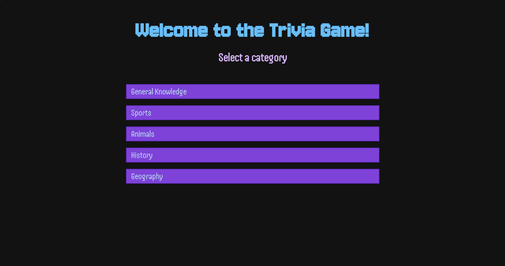
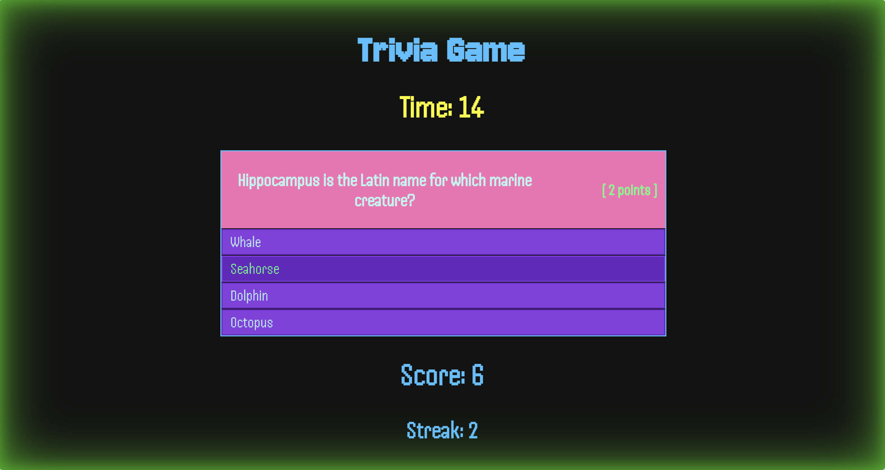
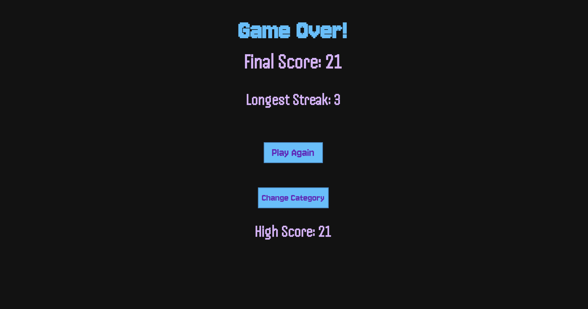

# Thomas' Trivia Game

A simple timed trivia game for people interested in topics like sports, animals, geography, and more.

## Demo





![Live Site]

## Installation

Clone the repository

```bash
git clone https://github.com/trdyer06/trivia-game.git
``
Open `index.html` in browser

## Tech Stack

- HTML5 - Structure
- CSS3 - Styling and animations
- JavaScript ES6 - Game logic and API integration

## Features

- Dynamic 30-second timer
- Score and high-score trackers
- Multiple categories for questions
- Randomized question and answer orders
- Visual feedback for answers

### How to play

- Select the category from which you want to be asked questions
- Start the game
- Select the correct answer for as many questions as you can in 30 seconds
- Play again with questions in the same category or play with a different category

### Data Source

Questions provided by `opentdb.com`

### License

This project is licensed under the MIT License
